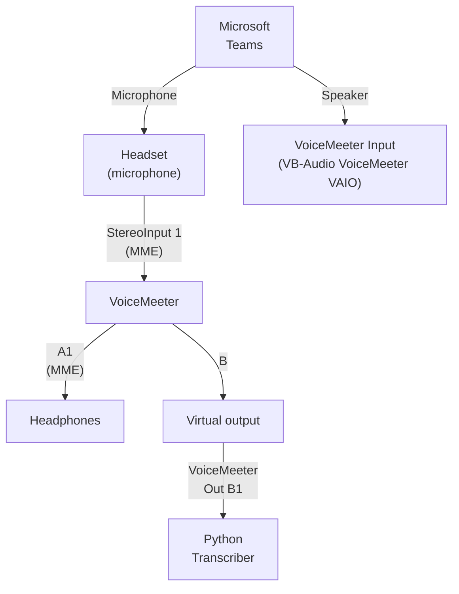
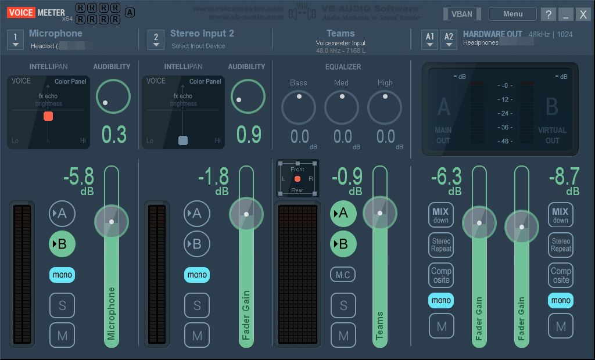

# utterly

A CLI tool for managing meeting recordings and transcriptions, with flexible processing capabilities. This tool provides a seamless pipeline for:
- Recording high-quality audio
- Transcribing recordings using Deepgram's models
- Processing transcripts using customisable Prompty templates

## Prerequisites

Before installing utterly, ensure you have the following:

- Python v3.12 or later installed on your system
- A Deepgram account and API key (free tier available at https://deepgram.com/)
- An OpenAI API key for GPT-4 access

## Prompty Integration

utterly uses .prompty files (located in the `prompts/` directory) to define structured interactions with language models. These files follow the [Prompty specification](https://prompty.ai/docs/prompty-specification) and allow for:

- Consistent prompt templates
- Environment variable integration
- Model configuration management
- Structured output formatting

The provided .prompty files include templates for:
- 1:1 meeting summaries
- Option analysis
- Meeting notes

Users are encouraged to extend the tool's capabilities by creating their own .prompty files. This flexibility allows for customized summarization formats, specialized analysis templates, and domain-specific prompts tailored to your organization's needs.

## Installation

1. Clone the repository:
```bash
git clone https://github.com/philipf/utterly.git
cd utterly
```

2. Install the package:
```bash
pip install -e .
```

3. Set up environment variables:
Create a `.env` file with your API keys:
```
DEEPGRAM_API_KEY=your_deepgram_key
OPENAI_API_KEY=your_openai_key
```

4. (Optional) Create a configuration file:
Copy the example configuration and modify as needed:
```bash
cp config.example.yaml config.yaml
```

## Usage

utterly can be used either as a complete pipeline or step-by-step using individual commands.

### Complete Pipeline

Record, transcribe, map speakers, and process in one go:
```bash
utterly 
```

The pipeline will:
1. Record your meeting (stop with Ctrl+C)
2. Prompt for a meeting name/description
3. Transcribe the recording with speaker diarisation
4. Help you map speaker labels to actual names
5. Process the transcript using the selected Prompty template

### Individual Commands

1. List audio devices:
```bash
utterly record --list-devices
```

2. Record a meeting:
```bash
utterly record [--device DEVICE_ID] [--filename OUTPUT.ogg]
```

3. Transcribe a recording:
```bash
utterly transcribe AUDIO_FILE [--output transcript.json]
```

4. Map speaker labels to names:
```bash
utterly speaker-map TRANSCRIPT_FILE
```

5. Process transcript:
```bash
utterly process TRANSCRIPT_FILE --template TEMPLATE_NAME [--output result.md]
```

### Audio Routing with VoiceMeeter

For optimal meeting recording quality, you can use VoiceMeeter to capture both your microphone input and the speakers' output into a single virtual device, which utterly can then record.

#### Why Use VoiceMeeter?

VoiceMeeter is a virtual audio mixer that allows you to route audio from multiple sources into a single recording stream. This is particularly useful for meeting recordings as it captures:
- Your voice through your microphone
- Other participants' voices from your speakers/headphones

This results in a complete recording of both sides of the conversation.

#### VoiceMeeter Setup Diagram



#### Installation and Configuration

1. **Download VoiceMeeter:**
   - Visit [VB-Audio website](https://vb-audio.com/Voicemeeter/) 
   - Download and install VoiceMeeter
   - Restart your computer after installation

2. **Configure VoiceMeeter:**
   - Set your physical microphone as Hardware Input 1
   - Set your headphones/speakers as Hardware Output A1

  

3. **Configure Microsoft Teams:**
   - Open Teams settings > Devices
   - Set Speaker to "VoiceMeeter Input (VB-Audio VoiceMeeter VAIO)"
   - Set Microphone to your physical microphone
   - Test your audio to ensure both incoming and outgoing audio work

4. **Record with utterly:**
    - List your audio devices to find the VoiceMeeter output:
      ```bash
      utterly record --list-devices
      ```
    - Start recording using the VoiceMeeter output device:
      ```bash
      utterly record --device <number matching VoiceMeeter Output (VB-Audio VoiceMeeter VAIO)>
      ```

This setup allows utterly to capture a complete recording of your meeting, including both your voice and other participants' voices in a single audio stream.

### Configuration

The tool can be configured using a YAML configuration file. Create your config by copying the example:
```bash
cp config.example.yaml config.yaml
```

Then specify the config file when running commands:
```bash
utterly --config config.yaml pipeline
```

## Features

### Recording
- High-quality audio recording
- Multiple audio device support
- Configurable channels and sample rate
- Automatic temporary filename generation
- Interactive post-recording naming
- Year-month subfolder organization
- Optional immediate transcription after recording

### Transcription
- Speaker diarisation
- Smart formatting
- Punctuation
- Utterance detection
- Meeting-optimized model (nova-2-meeting)

### Speaker Mapping
- Interactive speaker identification
- Maps automatically detected speaker labels to real names
- Temporary per-session mappings
- Integrates with transcription and processing pipeline

### Transcript Processing
- Flexible processing using Prompty templates
- Multiple processing types:
  - Meeting summaries and action items
  - Option analysis with pros/cons
  - Performance appraisals
  - Custom processing templates
- Template-driven output formatting
- Configurable model parameters

## Development

To contribute to the project:

1. Create a virtual environment:
```bash
python -m venv venv
source venv/bin/activate  # Linux/Mac
# or
venv\Scripts\activate     # Windows
```

2. Install development dependencies:
```bash
pip install -e ".[dev]"
```

3. Run tests:
```bash
pytest
```

## License

MIT License - see LICENSE file for details.