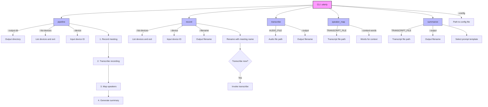
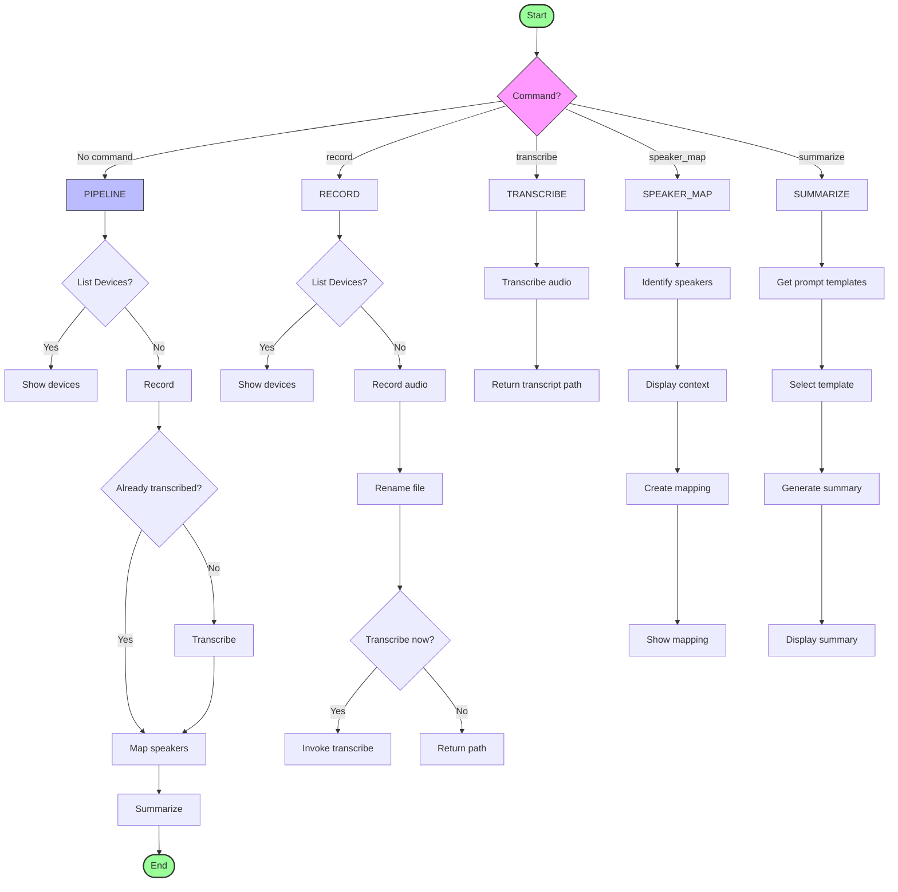
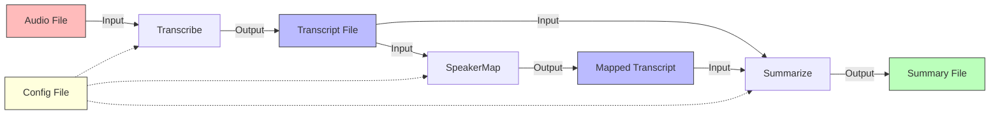

# Utterly CLI Structure Diagram

```mermaid
graph TD
    CLI[CLI: utterly] --> PIPELINE[pipeline]
    CLI --> RECORD[record]
    CLI --> TRANSCRIBE[transcribe]
    CLI --> SPEAKER_MAP[speaker_map]
    CLI --> SUMMARIZE[summarize]
    
    %% Global Config
    CLI -- "--config" --> CONFIG_FILE[Path to config file]
    
    %% Pipeline Command
    PIPELINE -- "--output-dir" --> OUTPUT_DIR[Output directory]
    PIPELINE -- "--list-devices" --> LIST_DEVICES_P[List devices and exit]
    PIPELINE -- "--device" --> DEVICE_ID_P[Input device ID]
    PIPELINE --> RECORD_STEP[1. Record meeting]
    RECORD_STEP --> TRANSCRIBE_STEP[2. Transcribe recording]
    TRANSCRIBE_STEP --> SPEAKER_MAP_STEP[3. Map speakers]
    SPEAKER_MAP_STEP --> SUMMARIZE_STEP[4. Generate summary]
    
    %% Record Command
    RECORD -- "--list-devices" --> LIST_DEVICES_R[List devices and exit]
    RECORD -- "--device" --> DEVICE_ID_R[Input device ID]
    RECORD -- "--filename" --> FILENAME_R[Output filename]
    RECORD --> RENAME[Rename with meeting name]
    RENAME --> TRANSCRIBE_ASK{Transcribe now?}
    TRANSCRIBE_ASK -- Yes --> TRANSCRIBE_R[Invoke transcribe]
    
    %% Transcribe Command
    TRANSCRIBE -- AUDIO_FILE --> AUDIO_PATH[Audio file path]
    TRANSCRIBE -- "--output" --> OUTPUT_T[Output filename]
    
    %% Speaker Map Command
    SPEAKER_MAP -- TRANSCRIPT_FILE --> TRANSCRIPT_PATH_S[Transcript file path]
    SPEAKER_MAP -- "--context-words" --> CONTEXT_WORDS[Words for context]
    
    %% Summarize Command
    SUMMARIZE -- TRANSCRIPT_FILE --> TRANSCRIPT_PATH_M[Transcript file path]
    SUMMARIZE -- "--output" --> OUTPUT_S[Output filename]
    SUMMARIZE --> SELECT_PROMPT[Select prompt template]
    
    style CLI fill:#f9f,stroke:#333,stroke-width:2px
    style PIPELINE fill:#bbf,stroke:#333,stroke-width:1px
    style RECORD fill:#bbf,stroke:#333,stroke-width:1px
    style TRANSCRIBE fill:#bbf,stroke:#333,stroke-width:1px
    style SPEAKER_MAP fill:#bbf,stroke:#333,stroke-width:1px
    style SUMMARIZE fill:#bbf,stroke:#333,stroke-width:1px
```

## Command Flow Diagram

```mermaid
flowchart TD
    Start([Start]) --> CLI{Command?}
    CLI -- No command --> PIPELINE
    CLI -- record --> RECORD
    CLI -- transcribe --> TRANSCRIBE
    CLI -- speaker_map --> SPEAKER_MAP
    CLI -- summarize --> SUMMARIZE
    
    %% Pipeline flow
    PIPELINE --> LIST_CHECK{List Devices?}
    LIST_CHECK -- Yes --> LIST_SHOW[Show devices]
    LIST_CHECK -- No --> RECORD_P[Record]
    RECORD_P --> TRANS_CHECK{Already transcribed?}
    TRANS_CHECK -- Yes --> SPEAKER_P[Map speakers]
    TRANS_CHECK -- No --> TRANSCRIBE_P[Transcribe]
    TRANSCRIBE_P --> SPEAKER_P
    SPEAKER_P --> SUMMARIZE_P[Summarize]
    SUMMARIZE_P --> End([End])
    
    %% Record flow
    RECORD --> DEVICES_CHECK{List Devices?}
    DEVICES_CHECK -- Yes --> SHOW_DEVICES[Show devices]
    DEVICES_CHECK -- No --> DO_RECORD[Record audio]
    DO_RECORD --> RENAME[Rename file]
    RENAME --> TRANSCRIBE_Q{Transcribe now?}
    TRANSCRIBE_Q -- Yes --> INVOKE_TRANS[Invoke transcribe]
    TRANSCRIBE_Q -- No --> RETURN_PATH[Return path]
    
    %% Other commands
    TRANSCRIBE --> DO_TRANS[Transcribe audio]
    DO_TRANS --> RETURN_TRANS[Return transcript path]
    
    SPEAKER_MAP --> IDENTIFY[Identify speakers]
    IDENTIFY --> DISPLAY_CONTEXT[Display context]
    DISPLAY_CONTEXT --> CREATE_MAP[Create mapping]
    CREATE_MAP --> SHOW_MAP[Show mapping]
    
    SUMMARIZE --> GET_PROMPTS[Get prompt templates]
    GET_PROMPTS --> SELECT[Select template]
    SELECT --> GENERATE[Generate summary]
    GENERATE --> DISPLAY[Display summary]
    
    style Start fill:#9f9,stroke:#333,stroke-width:2px
    style End fill:#9f9,stroke:#333,stroke-width:2px
    style CLI fill:#f9f,stroke:#333,stroke-width:1px
    style PIPELINE fill:#bbf,stroke:#333,stroke-width:1px
```

## Data Flow Diagram

```mermaid
flowchart LR
    Audio[Audio File] -- Input --> Transcribe
    Transcribe -- Output --> Transcript[Transcript File]
    Transcript -- Input --> SpeakerMap
    SpeakerMap -- Output --> MappedTranscript[Mapped Transcript]
    Transcript -- Input --> Summarize
    MappedTranscript -- Input --> Summarize
    Summarize -- Output --> Summary[Summary File]
    
    Config[Config File] -.-> Transcribe
    Config -.-> SpeakerMap
    Config -.-> Summarize
    
    style Audio fill:#fbb,stroke:#333,stroke-width:1px
    style Transcript fill:#bbf,stroke:#333,stroke-width:1px
    style MappedTranscript fill:#bbf,stroke:#333,stroke-width:1px
    style Summary fill:#bfb,stroke:#333,stroke-width:1px
    style Config fill:#ffd,stroke:#333,stroke-width:1px
```