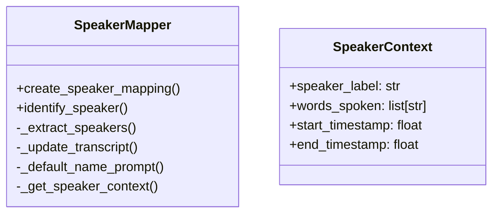

# Speaker Identification Enhancement Plan

## Overview
Add functionality to help identify speakers by showing their recent speech context, making it easier to map speakers to their actual names.

## Class Design



## Implementation Details

### 1. New Methods

#### identify_speaker
```python
def identify_speaker(self, transcript_path: str | Path, speaker_label: Optional[str] = None, context_words: int = 10) -> Union[SpeakerContext, List[SpeakerContext]]
```
- Parameters:
  - transcript_path: Path to the transcript file
  - speaker_label: Optional specific speaker to identify
  - context_words: Number of words to include for context (default 10)
- Returns: Single SpeakerContext or list of SpeakerContext objects
- Functionality:
  - If speaker_label provided: Returns context for that specific speaker
  - If no speaker_label: Returns context for all speakers

#### _get_speaker_context (private)
```python
def _get_speaker_context(self, transcript: dict, speaker_label: str, context_words: int) -> SpeakerContext
```
- Parameters:
  - transcript: Transcript dictionary
  - speaker_label: Speaker to get context for
  - context_words: Number of words to include
- Returns: SpeakerContext object
- Functionality:
  - Extract specified number of words for given speaker
  - Include timestamps if available
  - Handle edge cases (fewer words than requested, sentence boundaries)

### 2. Unit Tests

Create new test file `test_speaker_identification.py` with the following test cases:

1. Basic Functionality Tests
```python
def test_identify_single_speaker()
def test_identify_all_speakers()
def test_get_speaker_context()
```

2. Edge Cases
```python
def test_speaker_with_few_words()
def test_invalid_speaker_label()
def test_empty_transcript()
def test_missing_timestamps()
```

3. Context Size Tests
```python
def test_zero_context_words()
def test_large_context_size()
def test_negative_context_size()
```

4. Integration Tests
```python
def test_identify_speaker_with_mapping()
def test_multiple_speech_segments()
```

### 3. Example Usage

```python
# Get context for specific speaker
mapper = SpeakerMapper()
context = mapper.identify_speaker("transcript.json", "Speaker 1", context_words=10)
print(f"Speaker {context.speaker_label} said: {' '.join(context.words_spoken)}")

# Get context for all speakers
contexts = mapper.identify_speaker("transcript.json", context_words=5)
for context in contexts:
    print(f"Speaker {context.speaker_label} said: {' '.join(context.words_spoken)}")
```

## Error Handling

1. Invalid transcript format
2. Speaker not found
3. Invalid context_words parameter
4. File access errors

## Next Steps

1. Implement SpeakerContext class
2. Add new methods to SpeakerMapper
3. Create comprehensive test suite
4. Update documentation